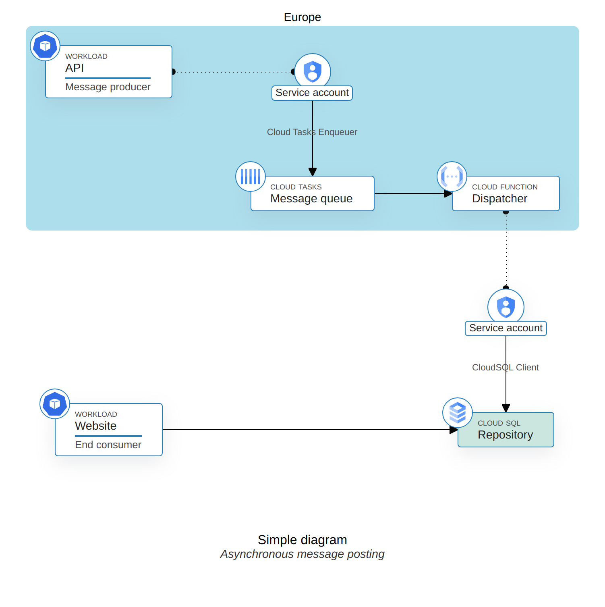

# Diagrams as Code (diagascode)

[Try it out!](https://jsfiddle.net/apognu/uyngxkmL/)

`diagascode` is a Javascript library and a Node script used to generate clean and customization diagrams from Javascript code.

It can be used to get diagrams such as this one:




## Concepts

`diagascode` uses Web technologies to draw the diagrams components, and use CSS grid to lay them out. Consequently, all components will be placed on a defined grid from provided coordinates.

Each component view is taken from one or several user-provided template where provided values are replaed to draw the final component.

When a component is defined, other component can be referred from it, either to position it relative to another, or to draw connections.

### Example

You can download a pre-built binary from the release page, or build it yourself with:

```shell
$ yarn build
$ go build .
```

Once you have the binary, you can execute it against a diagram definition to generate it. Some options can be added to the invocation:

 * `-diagram file.js`: the path to the diagram definition
 * `-css file.css`: path to a CSS file to apply to your diagram
 * `-templates file.html`: path to an HTML file containing node templates
 * `-assets directory`: path to directory containing static assets used in your diagram and addressable under `/assets/`
 * `-out file.png`: path to the output image file
 * `-debug`: run a webserver serving the diagram instead of generating an image

## Canvas

A canvas represents one diagram, it starts by being instantiated, and ends by being drawn. In between, you can add settings and components to it.

General options about the canvas can be configured before any node:

```typescript
import { Canvas } from '@apognu/diagascode';

window.onload = () => {
  const canvas = new Canvas({
    id: "area-id", // defaults to 'dac-area'
    title: "Diagram title",
    subtitle: "Some diagram subtitle",
    baseFontSize: 16,
    background: "red",
    padding: 32,
    columnGap: 32,
    rowGap: 32,
    draggable: false
  });

  // Add components
  canvas.add(...);

  canvas.draw();
}
```

`dragable: true` makes nodes dragable when used on a webpage. The title and subtitle will appear underneath the diagram and will bear the IDs `dac-title` and `dac-subtitle`.

## Zones

You can create zones that encompass several grid cells by instantiating a `Zone`. Any zone created will be sized to reach a quarter of the configured grid gaps. A zone will bear the class `dac-zone` and a zone title will have `dac-zone-title`. When a zone is created, a suitable padding is added to the document so that edge zones are not cropped.

You can customize the appearance of the zone's background and border colors, as well as adding a title.

```typescript
canvas.add(new Zone(
  { col: 2, row: 4, colSpan: 2, rowSpan: 2},
  { background: "red", border: "black", title: "A zone title"}
));
```

## Nodes

### Position

The only required argument (albeit somehow of low use) to create a node is its position:

```typescript
const node1 = canvas.add(Node({ row: 1, col: 1 }));
```

This will get the default template of ID `dac-dedault-template` from your HTML, duplicate it and place it at the specified coordinates in the CSS grid.

You can use a reference to another node to position a node:

```typescript
const node1 = canvas.add(Node({ row: 1, col: 1 }));
const node2 = canvas.add(Node({ row: node1.row + 1, col: node1.col }));
```

You can also make a component span several columns or rows by setting the `rowSpan` or `colSpan` attributes:

```typescript
const node1 = canvas.add(Node({ row: 1, col: 1, colSpan: 2, rowSpan: 2 }));
```

### Data binding

The second parameter to the `Node` constructor is a dictionary of key to value. The Node will go over its template, and will set the content of any tag bearing a class equal to the key to the specific value.

`` tags are handled separately to set the `src` attribute instead of the text content of the tag.

Any custom template must bear the class `dac-template`.

```html
<div id="dac-default-template" class="dac-template">
  <p class="title"></p>
  <p class="subtitle"></p>
</div>
```

```typescript
const node1 = new Node(
  { col: 1, row: 1 },
  { title: 'Lorem ipsum', subtitle: 'Dolor sit amet' }
);
```

### Connections

The third parameter to creating a `Node` is the list of connected nodes. In its simplest form, it can be a list of node reference:

```typescript
const node1 = canvas.add(Node({ row: 1, col: 1 }, {}, []));
const node2 = canvas.add(Node({ row: 1, col: 2 }, {}, [node1]); // Will be connected to node1).
```

Each connected node can also be provided as a Typescript tuple of `[node_ref, options]`. These options are mainly used to customize the appearance of the connecting line. Is has this form (where all items are optional):

```typescript
{
  anchor?: string[],
  handles?: {
    size?: number, // Size of the "port"
    sourceColor?: string, // Color of the source port
    destColor?: string, // Color of the destination (peer) port
    arrow?: boolean, // Whether to replace the port with an arrow
    direction?: "self" | "peer", // Which component should the arrow point
  },
  connection?: {
    cornerRadius?: number, // Corner radius for this connection (defaults to none)
    dashed?: boolean, // Whether to draw the line as dashed instead of full
    color?: string, // Color of the line
    size?: number, // Width of the line
    label?: string, // Label to draw in the middle of the line
  },
}
```

For example:

```typescript
const node1 = canvas.add(Node({ row: 1, col: 1 }, {}, []));
const node2 = canvas.add(new Node(
  { col: 2, row: 1 },
  { title: 'Lorem ipsum', subtitle: 'Dolor sit amet' },
  [
    [node1, { connection: { dashed: true } }],
  ],
));
```

### Appearance

The last argument to `Node` is used to customize the appearance of the component, it supports the following options:

```typescript
{
  template?: string, // The ID of the template to use, defaults to `dac-default-template`.
  class?: string, // Add a class to the resulting component to be styled with CSS
  background?: string, // Override the component background color.
  borderColor?: string, // Override the component border color.
  borderSize?: string, // And border size.
}
```
