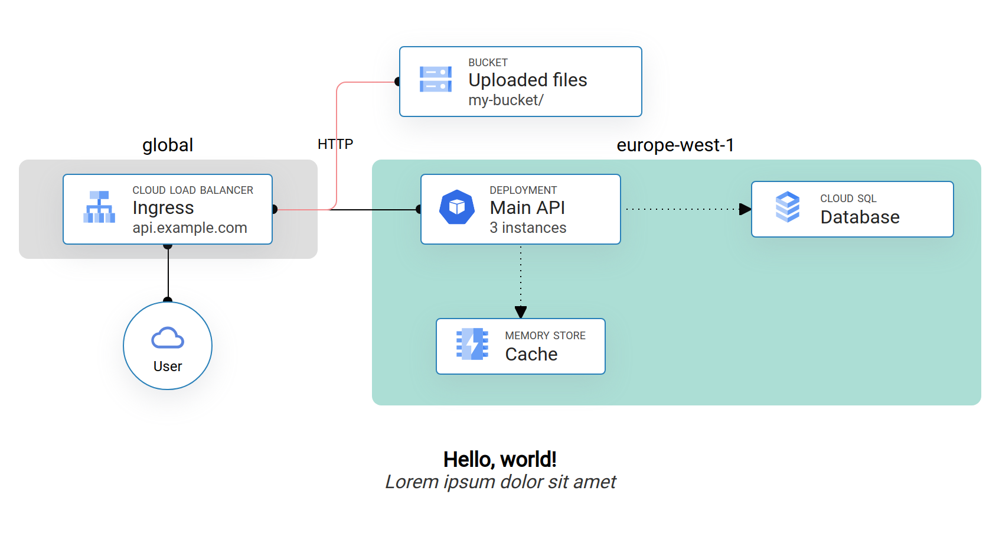

# Diagrams as Code (diagascode)

`diagascode` is a Javascript library and a Node script used to generate clean and customization diagrams from Javascript code.

It can be used to get diagrams such as this one:



## Concepts

`diagascode` uses Web technologies to draw the diagrams components, and use CSS grid to lay them out. Consequently, all components will be placed on a defined grid from provided coordinates.

Each component view is taken from one or several user-provided template where provided values are replaed to draw the final component.

When a component is defined, other component can be referred from it, either to position it relative to another, or to draw connections.

### Example

You can look into the `examples` directory to see a sample implementation of the project. After having imported `diagascode` in your `package.json`, you need to create an `index.html` file containing at the very least one template (denoted with the `template` class) and an import of your Javascript file describing your diagram.

You are free to add other elements as well, such as fonts and stylesheets to theme your components.

The Javascript file included in the HTML should import the library and, after page load, instantiate all the components needed to be drawn. The next section will explain how to do that.

To run the example, move there and run `npm exec diagascode-generate` to generate an image, or `npm exec vite` to launch a Web server serving the diagram.

## Node definition

### Position

The only required argument (albeit somehow of low use) to create a node is its position:

```typescript
const node1 = Node({ row: 1, col: 1 });
```

This will get the default template of ID `template` from your HTML, duplicate it and place it at the specified coordinates in the CSS grid.

You can use a reference to another node to position a node:

```typescript
const node1 = Node({ row: 1, col: 1 });
const node2 = Node({ row: node1.row + 1, col: node1.col });
```

You can also make a component span several column by setting the `span` attribute:

```typescript
const node1 = Node({ row: 1, col: 1, span: 2 });
```

### Data binding

The second parameter to the `Node` constructor is a dictionary of key to value. The Node will go over its template, and will set the content of any tag bearing a class equal to the key to the specific value.

`` tags are handled separately to set the `src` attribute instead of the text content of the tag.

```html
<div id="template" class="template">
  <p class="title"></p>
  <p class="subtitle"></p>
</div>
```

```typescript
const node1 = new Node(
  { col: 1, row: 1 },
  { title: 'Lorem ipsum', subtitle: 'Dolor sit amet' }
);
```

### Connections

The third parameter to creating a `Node` is the list of connected nodes. In its simplest form, it can be a list of node reference:

```typescript
const node1 = Node({ row: 1, col: 1 }, {}, []);
const node2 = Node({ row: 1, col: 2 }, {}, [node1]); // Will be connected to node1.
```

Each connected node can also be provided as a Typescript tuple of `[node_ref, options]`. These options are mainly used to customize the appearance of the connecting line. Is has this form (where all items are optional):

```typescript
{
  anchor?: string[],
  handles?: {
    size?: number, // Size of the "port"
    sourceColor?: string, // Color of the source port
    destColor?: string, // Color of the destination (peer) port
    arrow?: boolean, // Whether to replace the port with an arrow
    direction?: "from" | "to", // On which component to place the arrow
  },
  connection?: {
    dashed?: boolean, // Whether to draw the line as dashed instead of full
    color?: string, // Color of the line
    size?: number, // Width of the line
    label?: string, // Label to draw in the middle of the line
  },
}
```

For example:

```typescript
const node1 = Node({ row: 1, col: 1 }, {}, []);
const node2 = new Node(
  { col: 2, row: 1 },
  { title: 'Lorem ipsum', subtitle: 'Dolor sit amet' },
  [
    [node1, { connection: { dashed: true } }],
  ],
);
```

### Appearance

The last argument to `Node` is used to customize the appearance of the component, it supports the following options:

```typescript
{
  template?: string, // The ID of the template to use, defaults to `template`.
  class?: string, // Add a class to the resulting component to be styled with CSS
  background?: string, // Override the component background color.
  borderColor?: string, // Override the component border color.
  borderSize?: string, // And border size.
}
```
